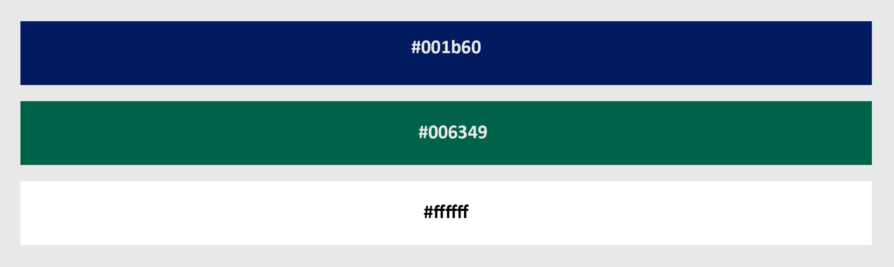

<h1>Aspen Runkel</h1> 
<h2>Section 50</h2>

<h3>Step 1: Determining Subject of Site</h3>
1. <strong>What is the subject of my site? What is its primary goal? Why did I decide on this subject?</strong>  
 
For my final project, I decided to build a website for my professional portfolio based on a marketing project I worked on with four other students in my class.  The purpose of the project was to relate the concepts we were learning in our marketing class to an actual business we found interesting.  We were instructed to choose a business in our assigned industry with which we would study throughout the semester and present our findings.  We were assigned with the tourism industry, and after some consideration we decided that Glacier National Park was the best fit for us.  Although it is not what you think of conventionally when you think of a "business", it was something we all felt strongly about considering that its "product" is not just a hunk of plastic on a shelf and the profits yielded by the park help maintain the park environment and surrounding economy. 
 
The primary goal of this website is to present our findings in an interesting way.  Our deliverable for the class included a series of blogs, two papers, and a powerpoint presentation which are not near as engaging or interactive as a website. 
 
I decided on this subject because I felt the content we developed while working on the project would translate well into a website and it would be a great addition to my professional portfolio.  Also, Glacier National Park is one of my favorite place, and I always enjoy the opportunity to incorporate it into my work.
 

<h3>Step 2: Preparing for Development</h3>
2. <strong>Collecting and Developing Content:</strong> 
 
For my site, I pulled content from two papers we wrote throughout our project.  The first paper focused on describing what we thought Glacier National Park's greatest marketing challenge is.  Our second paper focused on what we would propose as a solution to this problem.  I took the information from both papers and rewrote and editted it in a word document for various areas of my website including my home page and sub pages. 
 
 
 
 
 

3. <strong>Site Map:</strong> 
 
My site it set up according to the sequence of the marketing topic.  My homepage is a long page the serves as an introduction to each of the sub pages which link to the corresponding pages.  The subpages provide an in depth overview of our findings. 
 
 
 

4. <strong>Sketch and Wireframes:</strong> 
Mobile sketch, Medium sketch, and Computer sketch: 
 
 
 

5. <strong>Font and color choices:</strong> 
 
I choose a google font that I have used in past assignments called "Coustard" that I liked for its readability and bit of character. 
 
 
 
As far as colors, I chose colors that compliment the photos used on my site. 
 
 
 

<h3>Step 3: Time to Code</h3>
6. <strong>Setting up my directory:</strong> 
 
Setting up my directory was one of the first things I did.  Origninally, I had a html directory within my homework directory for this final project but I was having issues linking to other pages and including pictures so I decided to put the html files in the main homework directory instead.  The images directory in the main homework directory includes all the photos used in my readme while the images directory in the css folder includes all the photos used in the website. 
 
 
 

7. <strong>Component development:</strong> 
 
As suggested, I (partially) followed a modular build approach in which I built each component of my site individually and then brought them together.  After getting solid working versions of these various components, I used them to bring each page together. 
 

8. <strong>HTML:</strong> 
 
<strong>Homepage</strong> 
I started with the html I worked on during week 11 because I decided that I wanted to stick with the same theme - Paralax layout based on marketing Glacier National Park.  After some major brainstorming of how I wanted to present my content, I wrote it all up in a word document (as already mentioned) and then brought it into the index.html document.  With the major grunt work of coding the html done in the previous week, it was mostly a matter of fine tuning and changing text. 
 
<strong>Subpages</strong> 
I then took the basic html structure from this index page and copied it into my idividual pages. 
 
 
 
After this was done, I customized each page with the content I had written up for each page. 
 
 
 
 
 
After some tinkering, the html for my site was done aside from adjusting id and class elements so that I could style them how I wanted.

9. <strong>CSS:</strong> 
 
Like my html, I used most of the CSS that I had used in week 11 homework which was derived with the help of the course website and textbook.  I used the textbook a lot for images, forms, and sizing/formatting/etc.  As a bit of a side note, shoutout to whoever selected this textbook for this class.  It's well written, informative, and presents relatively boring content in an interesting way.  ALSO, it is easy on the pocketbook.  I plan on keeping it long after this class is over. 
 
I decided to create an html file for my index file and then create a separate one for all of my subpages.  This helped clean things up and allowed me to make better adjustments. One of the main reasons I decided to do the separate css file was that it allowed me to change the sizing on the images and separated the form html styling for the contact page. 
 

10. <strong>User testing:</strong> 
Throughout every stage of development, I consulted my roommates and classmates for opinions on each phase. They helped me decide on colors, text, and layout for my website.  Specifically, one of my roomates suggested I make the image on the top of the subpages smaller than the index page.  I thought this was a great idea and decided to take her advice. 
 

9. <strong>Problems and solutions:</strong> 
I struggled the most with the form on the contact page.  I had issues formatting the text, size, and buttons for quite a while.  I eventually scrapped it, started over, and it went easily.  Overall, I'm happy with how it all turned out.  

<h3>Conclusion</h3>
8. <strong>My experience with this final project:</strong> 
Overall, my experience working through this final project was... productive.  Because I was able to build off of my work from the week before, it took less time than i initially anticipated.  Also, I am all about making school projects that I can actually use outside of school.  This was always one of my pet peeves in art class or other creative content classes.  I am looking forwarding to including this in my personal portfolio.  
 
9. <strong> Moving forward in web development:</strong> 
As I move forward, I will utilize what I have learned over the course of the semester as a base for my web development.  I will graduate in May 2018 with a Bachelor's of Science in Business Administration majoring in Marketing with a minor in Media Arts and Digital Marketing Certificate.  My primary goal for this class was to gain a better understanding of web development so that I can apply it to my work as a business student.  I feel like I accomplished this and that it is a practical skill for the rest of my career.  Although you con do most web development now-a-days without knowing how to code, I am all for it and am glad I was able to build something I'm proud of with it.
